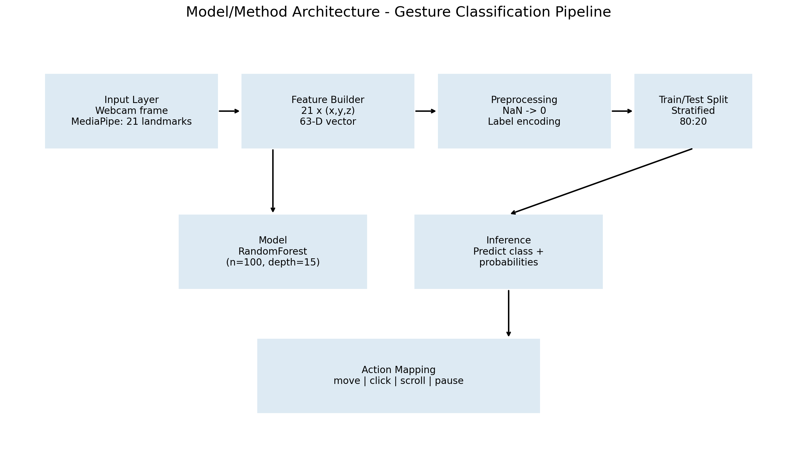

# Gesture Project Analysis Report


### 1) Dataset Description (With Attributes)

- Total samples: **4600**
- Total attributes: **64** (63 input features + 1 target label)
- Feature columns: **63**
- Missing values: **0**
- Class distribution:
- click: 1150 samples
- move: 1200 samples
- pause: 1100 samples
- scroll: 1150 samples

**Attributes**
- `landmark_0_x` to `landmark_20_x`: X-coordinates of 21 hand landmarks (normalized)
- `landmark_0_y` to `landmark_20_y`: Y-coordinates of 21 hand landmarks (normalized)
- `landmark_0_z` to `landmark_20_z`: Z/depth values of 21 hand landmarks (normalized)
- `gesture`: Target class label (`move`, `click`, `scroll`, `pause`)

### 2) Model/Method Architecture

**Input Layer**
- Per frame: 21 MediaPipe hand landmarks
- Flattened features: 21 × 3 = 63 values

**Data Pipeline**
- CSV loading (`gesture_data.csv`)
- NaN handling using zero imputation
- Label encoding for gesture classes
- Stratified train/test split (80/20)

**Classifier**
- RandomForestClassifier
- Hyperparameters: `n_estimators=100`, `max_depth=15`, `min_samples_split=5`, `min_samples_leaf=2`

**Inference Flow**
1. Capture hand landmarks
2. Form 63-D feature vector
3. Predict class + probability distribution
4. Apply action mapping (`move`, `click`, `scroll`, `pause`)




### 3) Tentative Results (Results-Focused)

This section intentionally emphasizes empirical outcomes from the provided sample dataset.

**Overall Metrics**
- Training Accuracy: **0.9997**
- Test Accuracy: **0.9957**
- Weighted Precision: **0.9957**
- Weighted Recall: **0.9957**
- Weighted F1-score: **0.9957**
- Micro-average ROC AUC: **1.0000**
- Micro-average PR AUC: **0.9999**

**Per-Class Performance (classification report)**

```
              precision    recall  f1-score   support

       click       1.00      1.00      1.00       230
        move       0.99      1.00      0.99       240
       pause       1.00      1.00      1.00       220
      scroll       1.00      0.99      1.00       230

    accuracy                           1.00       920
   macro avg       1.00      1.00      1.00       920
weighted avg       1.00      1.00      1.00       920

```


### 4) Visualizations in Graphs

Generated and saved under `visualizations/`:

- `class_distribution.png` → class/sample count distribution
- `xyz_histograms.png` → histograms of landmark X/Y/Z coordinate distributions
- `confusion_matrix.png` → class-wise prediction performance
- `feature_importance_top15.png` → most informative landmark features
- `oob_error_curve.png` → model error curve (loss-like curve using OOB error)
- `learning_curve.png` → train/validation learning behavior
- `roc_curve_multiclass.png` → one-vs-rest ROC curves with AUC
- `precision_recall_curve_multiclass.png` → one-vs-rest PR curves with AUC
